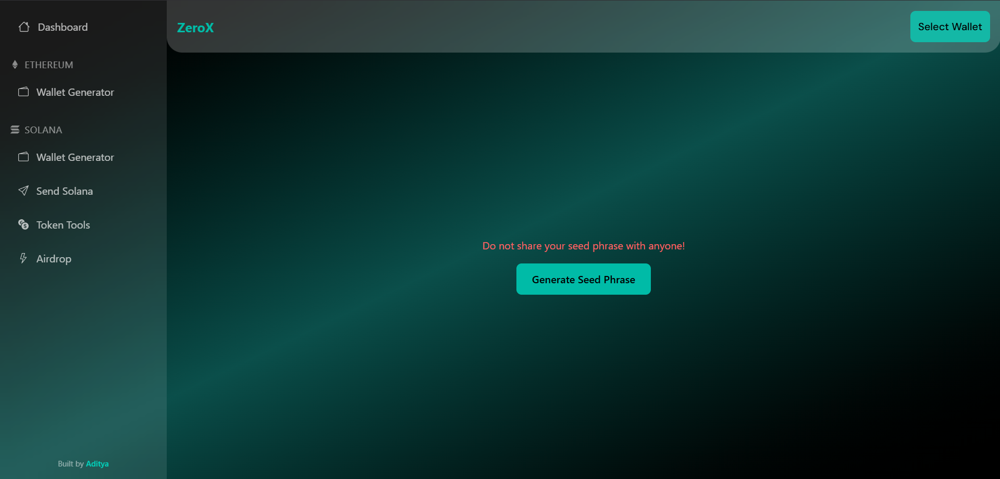

# 🪙 ZeroX — Multi‑Chain Wallet & Token Management Dashboard



### Overview

**ZeroX** is a web-based crypto wallet dashboard built with **React + TypeScript**. It provides a compact demo of multi‑chain wallet functionality for both **Ethereum** (EVM) and **Solana** (non‑EVM).

Key capabilities include:

- Generate secure seed phrases and hierarchical deterministic (HD) wallets
- Create and manage Ethereum & Solana wallet addresses
- Send and receive Solana (SOL)
- Request SOL airdrops on Solana Devnet
- Create and mint simple SPL tokens (demo)

This repository demonstrates integration patterns for EVM and non‑EVM chains using common SDKs and wallet adapters.

---

## Tech stack

| Category | Tools / Libraries |
|---|---|
| Frontend | React (Vite + TypeScript) |
| Styling | TailwindCSS, custom CSS |
| Solana | `@solana/web3.js`, `@solana/spl-token`, `@solana/wallet-adapter` |
| Ethereum | `ethers`, `bip39` |
| Notifications | `react-toastify` |
| Routing | `react-router-dom` |
| State | React Context API |

---

## Project structure

```
ZeroX/
├─ src/
│  ├─ components/
│  │  ├─ Navbar.tsx           # Top bar with wallet connect button
│  │  └─ Sidebar.tsx          # Navigation menu for ETH & SOL tools
│  ├─ context/
│  │  └─ MnemonicContext.tsx  # React context for storing mnemonic (seed phrase)
│  ├─ pages/
│  │  ├─ Dashboard.tsx        # Generate & copy seed phrase
│  │  ├─ Ethereum/
│  │  │  ├─ EthWallet.tsx
│  │  │  ├─ EthSend.tsx
│  │  │  └─ EthToken.tsx
│  │  └─ Solana/
│  │     ├─ SolWallet.tsx
│  │     ├─ SolSend.tsx
│  │     ├─ SolAirdrop.tsx
│  │     └─ SolToken.tsx
│  ├─ App.tsx
│  ├─ main.tsx
│  ├─ index.css
│  └─ App.css
├─ package.json
├─ tailwind.config.js
├─ tsconfig.json
└─ README.md
```

---

## Installation & setup

1. Clone the repository:

```bash
git clone https://github.com/theEquinoxDev/ZeroX.git
cd ZeroX
```

2. Install dependencies (Node.js >= 16, Node 18+ recommended):

```bash
npm install
# or
# yarn install
```

3. Environment variables

Create a `.env` file in the project root with at least the following (example):

```env
VITE_SOLANA_RPC=https://api.devnet.solana.com
```

4. Run the app:

```bash
npm run dev
```

Open the app at http://localhost:5173 (Vite default).

---

## Features breakdown

### 1. Seed phrase & wallet management

- Generates a BIP‑39 compliant 12‑word mnemonic.
- Seed is stored in memory (React Context) for demo purposes — not persisted to local storage.
- Copy seed phrase functionality is available.
- Derive multiple Ethereum and Solana wallets using standard derivation paths:

	- Ethereum: `m/44'/60'/0'/0/n`
	- Solana: `m/44'/501'/n'/0'`

### 2. Ethereum wallet generator

- Derives HD wallets from the mnemonic using `ethers` + `bip39`.
- Displays derived ETH addresses.
- Uses EIP‑44 derivation standard.

### 3. Solana wallet tools

- **Solana wallet generator** — derives ed25519 keys (ed25519‑hd‑key) and lists public keys with indices.
- **Send SOL** — send SOL to valid addresses using `SystemProgram.transfer` and wallet adapter signing.
- **Airdrop (Devnet)** — request free SOL on Devnet and display balance updates.
- **SPL token creator** — create a token, initialize associated accounts, and mint an initial supply using `@solana/spl-token`.

---

## Navigation (routes)

| Section | Path | Description |
|---:|:---|:---|
| Dashboard | `/` | Generate & copy seed phrase |
| Ethereum Wallet | `/eth/wallet` | Generate ETH addresses |
| Solana Wallet | `/sol/wallet` | Generate SOL addresses |
| Send SOL | `/sol/send` | Send SOL transactions |
| Token Tools | `/sol/token` | Create SPL tokens |
| Airdrop | `/sol/airdrop` | Request Devnet airdrops |

---

## UI & styling

- Responsive design using TailwindCSS.
- Glassmorphism styles (backdrop blur, translucent panels).
- Custom styles for wallet connect button overrides.

---

## Author

Aditya — Blockchain Developer

Built with ❤️ using React, TypeScript, and Solana Web3.js

---

## License

This project is licensed under the MIT License. You are free to use, modify, and distribute with attribution.
